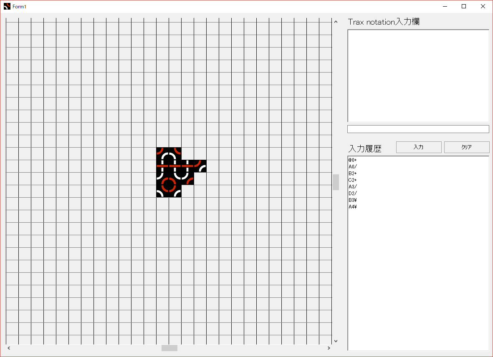

# TraxViewer

## 概要

TraxNotationで記述されたTraxゲームの棋譜を可視化するためのツールです。

右上のテキストボックスからは複数手を同時に入力でき、入力ボタンで棋譜を反映できます。真ん中のテキストフィールドからは1行のみしか入力できませんが、Enterキーで入力内容を反映できます。

また、盤面が表示されている部分については上下左右スクロールできるため、かなり大きな盤面までの表示に対応しています。